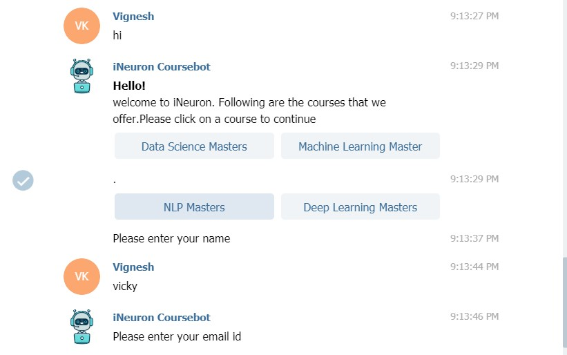
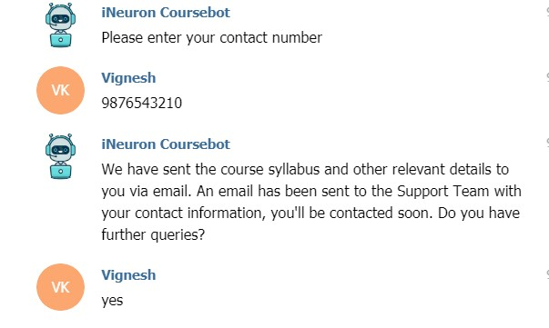
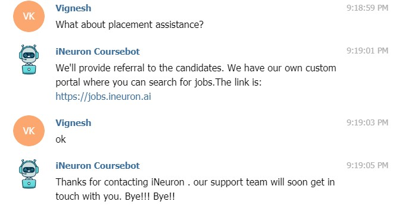
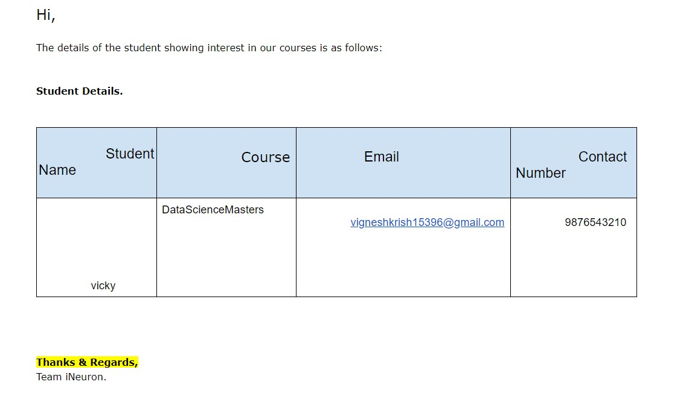
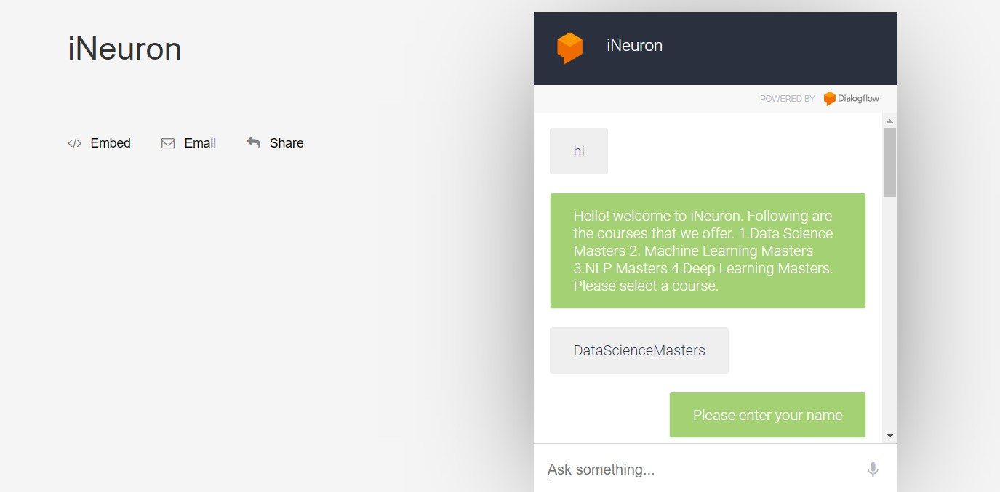
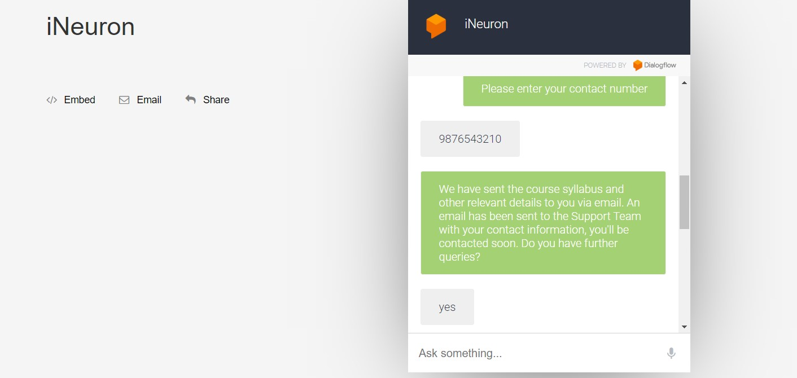
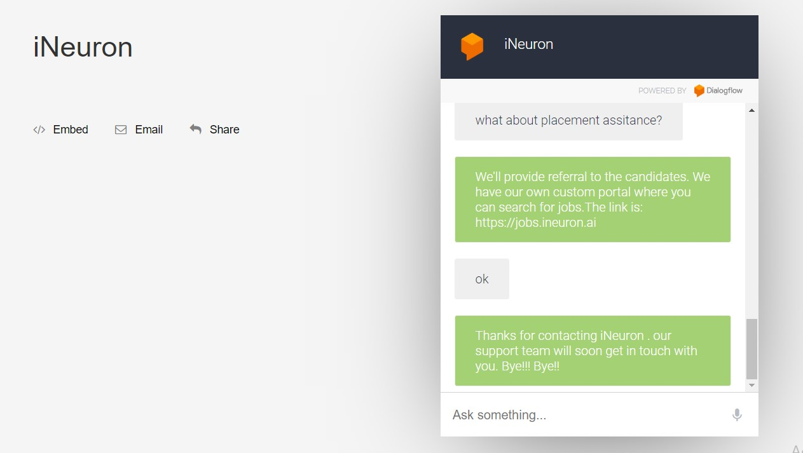
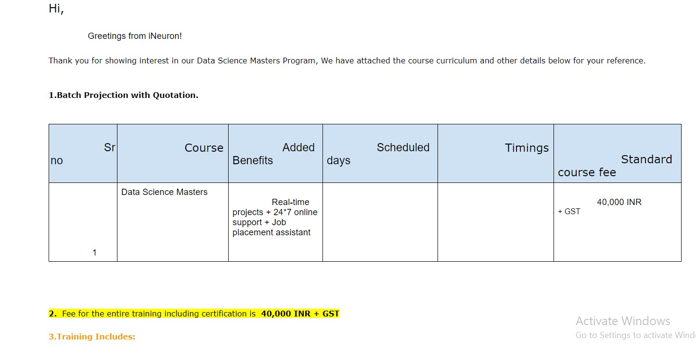

# Google-Dialogflow-chatbot for course selection

# Telegram - Bot Intergration 

Name:@iNeuron_Coursebot (search with this name in Telegram App or Telegram Web)

link: https://t.me/iNeuron_Coursebot

a.	User chat with the bot.

b.	User Received a mail from bot with the course details

c. support team received a mail from bot with the user details

# Bot in Web

a.	User chat with the bot.

b.	User Received a mail from bot with the course details

c. support team received a mail from bot with the user details

